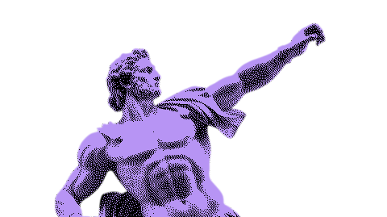
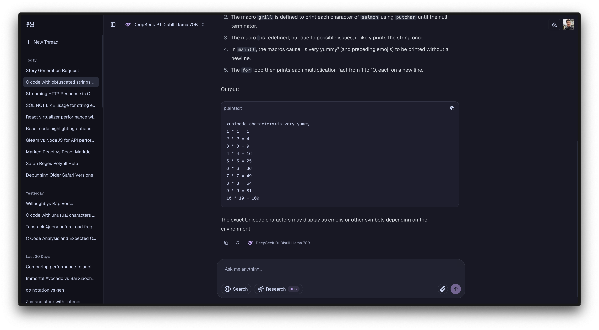

  

  <h3 align="center">Zeron Chat</h3>

  

    A unified AI chat app with models from Claude, OpenAI, Gemini, and more.
     
    <a href="https://github.com/zeronsh/chat/issues">Report Bug</a>
    ·
    <a href="https://github.com/zeronsh/chat/issues">Request Feature</a>
  

---

## About The Project

Zeron Chat is a sleek, modern, and unified AI chat application. It allows you to interact with large language models from Anthropic (Claude), OpenAI (GPT), and Google (Gemini) all in one place.

  

## Key Features

-   **Resumable Streams**: Continue generating responses even after a page refresh.
-   **Fast Navigation**: Quickly switch between different chat sessions.
-   **Search Tool**: Integrated search functionality. Using [Exa](https://www.exa.ai/)
-   **Research Tool**: Perform research within the chat interface.
-   **Theming**: Multiple themes to customize the look and feel.

## Built With

This project is built with:

-   [TanStack Start](https://tanstack.com/start/latest)
-   [Zero](https://zero.rocicorp.dev/)
-   [Vercel AI SDK](https://sdk.vercel.ai/)
-   [React](https://react.dev/)
-   [TypeScript](https://www.typescriptlang.org/)
-   [Shadcn/UI](https://ui.shadcn.com/)

## License

Distributed under the MIT License. See `LICENSE` for more information.
